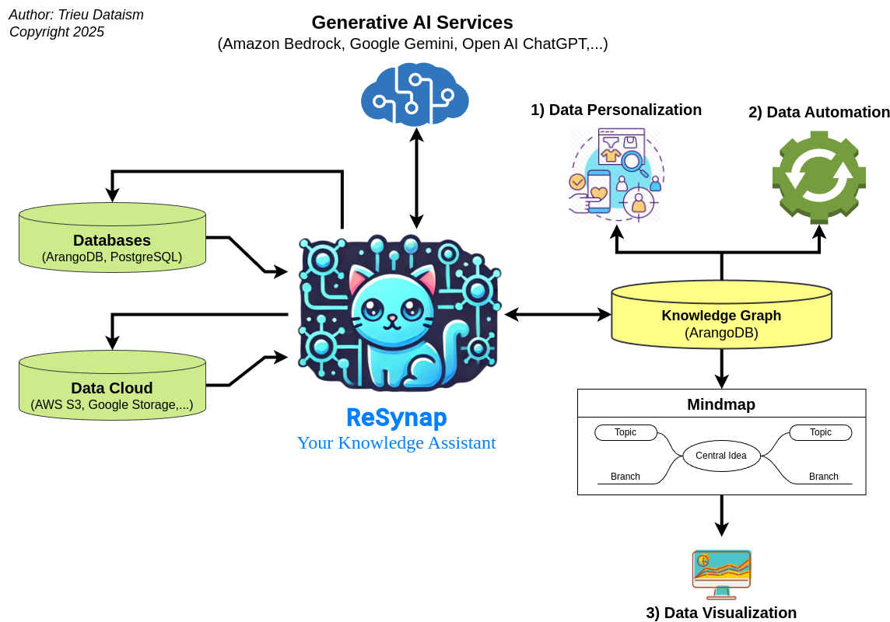

# ReSynap

**ReSynap: Knowledge Graph AI Agent for MindMap Generation, Data Personalization and Data Automation**

Welcome to **ReSynap**—an advanced Knowledge-RAG agent designed to generate dynamic mind maps from text, transform text chats into visual knowledge graphs, build a personalization engine, and automate a range of tasks that integrate with customer data platforms (CDPs) and more.



## Features

1.  **Dynamic Mind Map Generation**: Easily convert text into comprehensive mind maps that visually organize information and relationships.
  
2.  **Text-to-Knowledge Graphs**: Transform unstructured text chats into interactive knowledge graphs, uncovering insights and making connections intuitive.

3.  **Customer Profile Classification**: Automatically classify customer profiles within CDPs, allowing for personalized segmentation and enhanced targeting.

4.  **Data Reports and Insights**: Generate detailed data reports with ease, helping teams stay informed with up-to-date insights.

5.  **Customer Segmentation**: Segment customer data effectively based on behavior, demographics, or any custom metric that fits your business needs.

6.  **Real-Time Product Recommendations**: Get tailored product recommendations for specific user profiles, enabling targeted marketing and enhancing user experience.

7.  **Automated Tasks**:
    1. Send personalized emails at scale.
    2. Trigger Zalo notifications to keep customers engaged.
    3. Automate various customer-related workflows with seamless integration.

## Use Cases

- **Marketing Automation**: Automate segmentation and customer communications.
- **Customer Data Analysis**: Deepen your insights into customer behavior and preferences.
- **Product Recommendations**: Serve real-time, relevant recommendations to improve engagement and conversion.
- **Knowledge Management**: Use knowledge graphs for easy data retrieval and management.
- **Workflow Automation**: Set up triggers for automating tasks across multiple platforms.

## Getting Started

1. **Installation**: [TODO]
2. **Usage**: [TODO]
3. **API Integration**: [TODO]

## Contributions

Contributions to ReSynap are welcome! Please follow the [contribution guidelines](link to contribution guidelines) and submit your pull requests.

---

With ReSynap, transform data and text into actionable, visual insights and automate your workflows seamlessly!

## System requirements

- Python 3.10+
- FastAPI
- Pydantic
- Qdrant Vector Database. Refer to the Qdrant documentation for instructions: https://qdrant.tech/documentation/quick-start/
- Qdrant client library (install with `pip install qdrant-client`)
- ArangoDB for graph database
- Redis or Apache Kafka for data processing on queue
- Large language models (LLMs) likes Google Gemini or OpenAI   

## Installation

1. Clone the repository:
```bash
   git clone https://github.com/trieu/resynap
```

2. Create env
```bash
    python -m venv env
    source env/bin/activate
```

3. Install the dependencies:
```bash
   pip install -r requirements.txt
```

4. Start the Qdrant server:
```bash
   ./start_qdrant.sh
```

5. Next, create a .env file by coping the file sample.env or create your own file with content:
```
    QDRANT_HOST=localhost
    QDRANT_PORT=6333

    QDRANT_CLOUD_HOST=
    QDRANT_CLOUD_API_KEY=

    API_HOST=0.0.0.0
    API_PORT=8000

    REDIS_HOST=
    REDIS_PORT=0
    DEFAULT_AUTHORIZATION_KEY=personalization_test
```

## Running the API

```bash
uvicorn main:api_personalization --reload 
```
This will start the API server. You can access the API documentation at `http://localhost:8000/docs`

## API Endpoints

    All API Endpoints must be called with the header: Authorization = [your_api_key]
    The [your_api_key] must be in Redis. E.g: 127.0.0.1:6480> set personalization_test true

### Profiles

- **`POST /add-profile/`**
    - Adds a single user profile to the database.
    - Request body: `ProfileRequest` object (see below)
    - Response: `{"status": "Profile added successfully"}`
- **`POST /add-profiles/`**
    - Adds multiple user profiles to the database in bulk.
    - Request body: List of `ProfileRequest` objects 
    - Response: `{"status": "All profiles added successfully"}`
- **`POST /check-profile-for-recommendation/`**
    - Add or update a profile, then  get real-time recommendations for the profile
    - Request body: `ProfileRequest` object
    - Response: List of recommended products (see example below)

### Products

The product management API

- **`POST /add-product/`**
    - Adds a single product to the database.
    - Request body: `ProductRequest` object (see below)
    - Response: `{"status": "Product added successfully"}`
- **`POST /add-products/`**
    - Adds multiple products to the database in bulk.
    - Request body: List of `ProductRequest` objects
    - Response: `{"status": "All products added successfully"}`

### Contents

The content management API

- **`POST /add-content/`**
    - Adds a single content item to the database.
    - Request body: `ContentRequest` object (see below)
    - Response: `{"status": "Content item added successfully"}`
- **`POST /add-contents/`**
    - Adds multiple content items to the database in bulk.
    - Request body: List of `ContentRequest` objects
    - Response: `{"status": "All content items added successfully"}`

### Recommendations

The recommendation API to personalize product, contents and both.

- **`GET /recommend/{profile_id}`**
    - Gets personalized product recommendations for a given profile ID.
    - Path parameters:
        - `profile_id`: The ID of the user profile.
        - `item_type`: The item type to get recommendation: product, content, or both.
    - Query parameters:
        - `top_n` (optional): The maximum number of recommendations to return (default: 8).
        - `except_product_ids` (optional): Comma-separated string of product IDs to exclude from 
        - `except_content_ids` (optional): Comma-separated string of content IDs to exclude from recommendations (e.g., "item_1,item_3").
    - Response: List of recommended product / content IDs (see example below)

## Data Models

**ProfileRequest:**

```json
{
    "profile_id": "crm_11",
    "page_view_keywords": [
        "car",
        "bike",
        "accessories"
    ],
    "purchase_keywords": [
        "helmet",
        "gloves"
    ],
    "interest_keywords": [
        "travel",
        "photography",
        "outdoors"
    ],
    "additional_info": {
        "age": 28,
        "location": "Germany"
    }
}
```

**ProductRequest:**

```json
{
    "product_id": "item_1",
    "product_name": "Macbook Pro",
    "product_category": "Electronics",
    "product_keywords": ["tech", "work", "portable"],
    "additional_info": {"brand": "Apple", "price": 1200}
}
```

**ContentRequest:**

```json
{
    "content_id": "item_1",
    "title": "Macbook Pro",
    "content_category": "Electronics",
    "content_keywords": ["tech", "work", "portable"]
}
```

## Example Usage

### Adding a Profile

```bash
curl -X POST \
  http://localhost:8000/add-profile/ \
  -H 'Content-Type: application/json' \
  -H 'Authorization: personalization_test' \
  -d '{
    "profile_id": "crm_15",
    "page_view_keywords": [
      "car",
      "bike",
      "accessories"
    ],
    "purchase_keywords": [
      "helmet",
      "gloves"
    ],
    "interest_keywords": [
      "travel",
      "photography",
      "outdoors"
    ],
    "additional_info": {
      "age": 28,
      "location": "Germany"
    }
  }'
```
### Getting Recommendations

```bash
curl -X GET \
  -H 'Authorization: personalization_test' \
  "http://localhost:8000/recommend/crm_15?top_n=5&except_product_ids=item_1,item_6" 
```

## Future Improvements

- Implement more sophisticated vectorization techniques for user profiles and product data. 
- Add support for more advanced filtering and ranking options for recommendations.
- Integrate with a user interface for managing profiles and products.