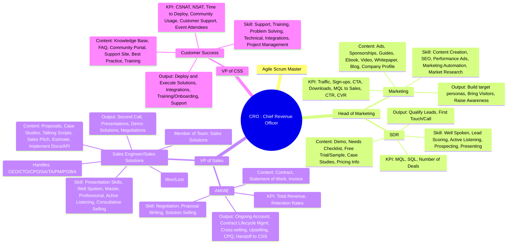

```mermaid
mindmap
  root((CRO : Chief Revenue Officer))
    Agile Scrum Master
    Head of Marketing
      Marketing
        Output: Build target personas, Bring Visitors, Raise Awareness
        KPI: Traffic, Sign-ups, CTA, Downloads, MQL to Sales, CTR, CVR
        Content: Ads, Sponsorships, Guides, Ebook, Video, Whitepaper, Blog, Company Profile
        Skill: Content Creation, SEO, Performance Ads, Marketing Automation, Market Research
      SDR
        Output: Qualify Leads, First Touch/Call
        KPI: MQL, SQL, Number of Deals
        Content: Demo, Needs Checklist, Free Trial/Sample, Case Studies, Pricing Info
        Skill: Well Spoken, Lead Scoring, Active Listening, Prospecting, Presenting
    VP of Sales
      Sales Engineer/Sales Solutions
        Member of Team: Sales Solutions
        Handles: CEO/CTO/CPO/SA/TA/PM/PO/BA
        Output: Second Call, Presentations, Demo Solutions, Negotiations
        KPI: Close Deal (Won/Lost)
        Content: Proposals, Case Studies, Talking Scripts, Sales Pitch, Estimate, Implement Docs/API
        Skill: Presentation Skills, Well Spoken, Master, Professional, Active Listening, Consultative Selling
      AM/AE
        Output: Ongoing Account, Contract Lifecycle Mgmt, Cross-selling, Upselling, CPQ, Handoff to CSS
        KPI: Total Revenue, Retention Rates
        Content: Contract, Statement of Work, Invoice
        Skill: Negotiation, Proposal Writing, Solution Selling
    VP of CSS
      Customer Success
        Output: Deploy and Execute Solutions, Integrations, Training/Onboarding, Support
        KPI: CSNAT, NSAT, Time to Deploy, Community Usage, Customer Support, Event Attendees
        Content: Knowledge Base, FAQ, Community Portal, Support Site, Best Practice, Training
        Skill: Support, Training, Problem Solving, Technical, Integrations, Project Management
```