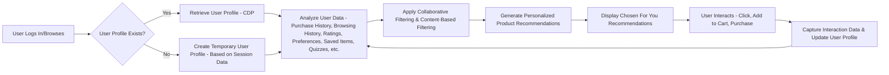
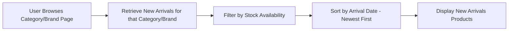
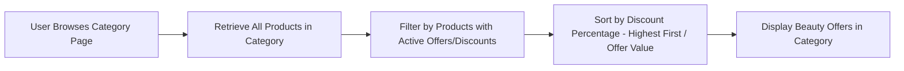
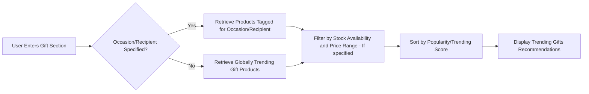
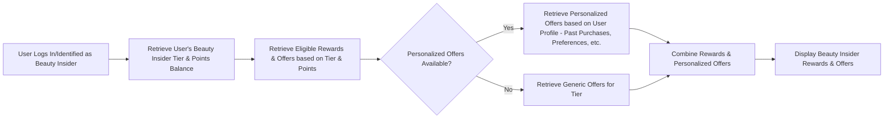

## Sephora Recommendation System Activity Diagrams

Here are activity diagrams for five Sephora recommendation use cases, focusing on the system logic behind the recommendations:

**1. Chosen For You (Personalized Recommendations)**

**2. New Arrivals (Category/Brand Specific)**

**3. Beauty Offers (Best Offers in Specific Category)**

**4. Trending Gifts (Occasion/Recipient Based)**

**5. Beauty Insider Rewards (Personalized Rewards & Offers)**

**Key Explanations & Considerations:**

* **CDP (Customer Data Platform):** A central hub storing user profiles and enabling personalized experiences.
* **Collaborative Filtering:** Recommending products based on what similar users have liked or purchased.
* **Content-Based Filtering:** Recommending products based on a user's past interactions and preferences.
* **Trending Score:** A metric calculated based on recent sales, reviews, social media buzz, etc., to identify trending products.
* **Stock Availability:**  Filtering ensures only available products are recommended.
* **Real-time Updates:** User profiles and recommendations are ideally updated in real-time as users interact with the platform.
* **A/B Testing:** Continuous A/B testing helps optimize recommendation algorithms and improve performance.

These activity diagrams provide a high-level overview of the recommendation logic.  Sephora's actual implementation would be significantly more complex, incorporating factors like inventory management, pricing, promotions, and various business rules. However, these diagrams serve as a strong foundation for understanding the key components and flow of information within Sephora's recommendation system.
