Using Sephora.com as a case study, here are the activity diagrams for each recommendation system use case:

---

### 1. **Chosen For You**

**Description**: This use case provides highly personalized recommendations based on Sephora's knowledge of the user's preferences, purchase history, and browsing behavior.

**Activity Diagram**:
1. **User Opens Sephora App or Website**
   - User visits the main interface.
2. **Collect User Data from CDP**
   - Retrieve user's browsing history, purchase history, product reviews, and profile data from Sephora’s CDP.
3. **Apply Collaborative Filtering**
   - Use collaborative filtering to identify similar Sephora users and gather product suggestions based on what similar users purchased or favorited.
4. **Apply Content-Based Filtering**
   - Cross-match user data (like skin type, beauty concerns, preferred brands) with Sephora’s product catalog attributes.
5. **Score and Rank Products**
   - Combine collaborative and content-based filtering results, apply weights, and score products.
6. **Display "Chosen For You" Recommendations**
   - Display the top-scored, most relevant products to the user.

---

### 2. **New Arrivals**

**Description**: This use case highlights recently launched products at Sephora, with recommendations tailored to the user's past preferences and browsing history.

**Activity Diagram**:
1. **User Visits New Arrivals Section**
   - User navigates to New Arrivals or the homepage.
2. **Fetch Recently Added Products**
   - Pull data on newly launched products from Sephora’s product catalog.
3. **Filter by User Preferences**
   - Narrow down new products based on the user's preferred categories, brands, and past behavior.
4. **Rank New Arrivals by Relevancy**
   - Rank products based on relevancy, user preferences, and initial popularity among similar users.
5. **Display New Arrivals**
   - Show the ranked new arrivals tailored to the user’s interests.

---

### 3. **Beauty Offers (Best Offers in a Specific Category)**

**Description**: This use case provides the user with the best available offers in their preferred product categories, enhancing engagement and conversions during promotions.

**Activity Diagram**:
1. **User Enters Beauty Offers Section**
   - User navigates to Beauty Offers or receives a notification about a sale.
2. **Retrieve Active Promotional Offers**
   - Retrieve active offers from Sephora’s promotions database, tagged by category.
3. **Filter by User Interest and Category Preferences**
   - Filter offers based on categories and brands the user frequently browses or buys.
4. **Rank Offers by Discount Value and Relevance**
   - Rank offers using Sephora's model based on discount amount, relevance to user preferences, and popularity.
5. **Display Beauty Offer Recommendations**
   - Present the highest-ranked offers relevant to the user in the Beauty Offers section.

---

### 4. **Trending Gifts**

**Description**: This use case recommends trending or popular gift items, tailored to the user’s preferences and any seasonal trends.

**Activity Diagram**:
1. **User Accesses Gift Section**
   - User navigates to the Gifts section.
2. **Fetch Trending Products**
   - Retrieve a list of currently popular or trending gift items based on user interactions across Sephora.
3. **Apply User-Specific Filters**
   - Apply filters based on the user's gift-related searches, purchases, and categories of interest.
4. **Incorporate Seasonality and Popularity Data**
   - Adjust rankings using seasonality (e.g., holiday season) and general popularity data from Sephora’s trend analysis.
5. **Rank Gift Items by Relevance and Trend Score**
   - Rank gift products using a trend score combined with user-specific relevance.
6. **Display Trending Gifts**
   - Show the trending gift recommendations that are most relevant to the user.

---

### 5. **Beauty Insider Rewards**

**Description**: This use case suggests redeemable rewards for users who are part of Sephora's loyalty program, highlighting rewards that align with the user’s past preferences and accumulated points.

**Activity Diagram**:
1. **User Visits Beauty Insider Rewards Page**
   - User opens the Rewards page within their Sephora account.
2. **Retrieve User's Points and Status**
   - Fetch the current loyalty points balance and tier status from Sephora’s loyalty database.
3. **Fetch Available Rewards Options**
   - Pull all reward options within the user’s points range.
4. **Filter Rewards Based on User’s Preferences and Past Redemptions**
   - Narrow down rewards by categories, brands, or product types the user frequently interacts with.
5. **Rank Rewards by Relevance and Value**
   - Rank rewards considering point value, popularity, and personal relevance.
6. **Display Recommended Rewards**
   - Show the top-ranked reward recommendations that the user can redeem based on their points.

---

These diagrams illustrate how Sephora can optimize each recommendation type through data filtering, personalized ranking, and seasonality adjustments to align with the user’s preferences, thereby enhancing engagement and driving conversions. 

```mermaid
graph LR

%% Chosen For You Use Case
subgraph Chosen For You
    A1[User Visits Site/App] --> A2[Collect User Data from CDP]
    A2 --> A3[Apply Collaborative Filtering]
    A2 --> A4[Apply Content-Based Filtering]
    A3 --> A5[Score and Rank Items]
    A4 --> A5
    A5 --> A6[Display 'Chosen For You' Recommendations]
end

%% New Arrivals Use Case
subgraph New Arrivals
    B1[User Visits New Arrivals Section] --> B2[Fetch Recently Added Products]
    B2 --> B3[Filter by User Preferences]
    B3 --> B4[Rank New Arrivals by Relevancy]
    B4 --> B5[Display New Arrivals]
end

%% Beauty Offers Use Case
subgraph Beauty Offers
    C1[User Enters Beauty Offers Section] --> C2[Retrieve Active Promotional Offers]
    C2 --> C3[Filter by User Interest and Category Preferences]
    C3 --> C4[Rank Offers by Discount Value and Relevance]
    C4 --> C5[Display Beauty Offer Recommendations]
end

%% Trending Gifts Use Case
subgraph Trending Gifts
    D1[User Accesses Gift Section] --> D2[Fetch Trending Products]
    D2 --> D3[Apply User-Specific Filters]
    D3 --> D4[Incorporate Seasonality and Popularity Data]
    D4 --> D5[Rank Gift Items by Relevance and Trend Score]
    D5 --> D6[Display Trending Gifts]
end

%% Beauty Insider Rewards Use Case
subgraph Beauty Insider Rewards
    E1[User Visits Beauty Insider Rewards Page] --> E2[Retrieve User's Points and Status]
    E2 --> E3[Fetch Available Rewards Options]
    E3 --> E4[Filter Rewards Based on User’s Preferences and Past Redemptions]
    E4 --> E5[Rank Rewards by Relevance and Value]
    E5 --> E6[Display Recommended Rewards]
end
```

